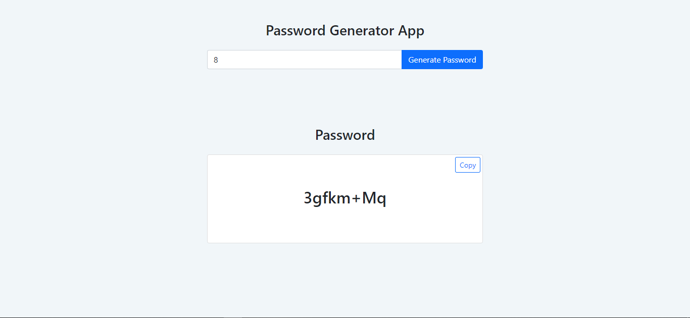

# ITS Password Generator

This project is a web interface that generates passwords in a random fashion.

## Motivation

I started this projec to automate an aspect of the work I do as an ITS support officer at the University Of Ghana Computing System.

## Screenshot

[](https://drive.google.com/file/d/1ozLLqT1RXJmseM14IPMwSHMfizx5uTvM/view?usp=sharing)

## URL

Password Generator App [Link](https://cryptic-hollows-59775.herokuapp.com/).

## Installation

1. Clone Repo
2. cd to the directory where requirements.txt is located
3. activate your virtualenv.
4. run: pip install -r requirements.txt in your shell

```bash
pip install -r requirements.txt
```

## Tech/framework used

1. HTML5
2. CSS3
3. Bootstrap 5
4. Python (Flask)

## Contributing

Pull requests are welcome. For major changes, please open an issue first to discuss what you would like to change.

## License

[MIT](https://choosealicense.com/licenses/mit/)
